**Vehicle Detection Project**

The goals of this project are the following:

* Perform a Histogram of Oriented Gradients (HOG) feature extraction on a labeled training set of images and train a classifier Linear SVM classifier
* Apply a color transform and append binned color features to the feature vector.
* Get the histogram and append the histogram features to the  feature vector.
* Normalize the features and randomize a selection for training and testing.
* Implement a sliding-window technique and use my trained classifier to search for vehicles in images.
* Run my pipeline on a video stream (start with the test_video.mp4 and later implement on full project_video.mp4) and create a heat map of recurring detections frame by frame to reject outliers and follow detected vehicles.
* Estimate a bounding box for vehicles detected.

## [Rubric](https://review.udacity.com/#!/rubrics/513/view) Points
### Here I will consider the rubric points individually and describe how I addressed each point in my implementation.

---

### Writeup

#### 1. Provide a Writeup / README that includes all the rubric points and how you addressed each one.  You can submit your writeup as markdown or pdf.  [Here](https://github.com/udacity/CarND-Vehicle-Detection/blob/master/writeup_template.md) is a template writeup for this project you can use as a guide and a starting point.

You're reading it!

### Histogram of Oriented Gradients (HOG)

#### 1. Explain how (and identify where in your code) you extracted HOG features from the training images.

The code for this step is contained in (code_cell 3 - line 29) of the IPython notebook.

I started by reading in all the `car` and `non-car` images.  Here is an example of one of each of the `car` and `non-car` classes:

I then explored different color spaces and different `skimage.hog()` parameters (`orientations`, `pixels_per_cell`, and `cells_per_block`).  I grabbed random images from each of the two classes and displayed them to get a feel for what the `skimage.hog()` output looks like.

Here is an example using the `YCrCb` color space and HOG parameters of `orientations=12`, `pixels_per_cell=(16, 16)` and `cells_per_block=(2, 2)`:

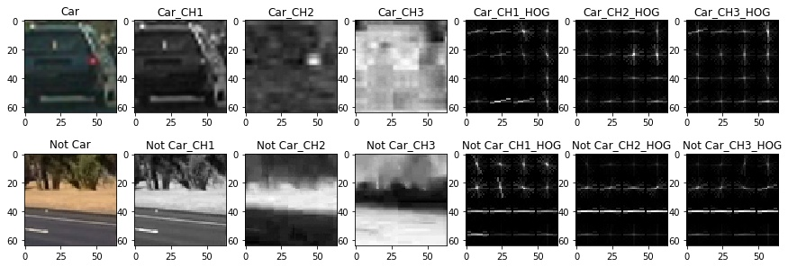

#### 2. Explain how you settled on your final choice of HOG parameters.

I tried various combinations of parameters and settled on the combination that gives a high test percentage for the classifier and gives the best result on the test images

#### 3. Describe how (and identify where in your code) you trained a classifier using your selected HOG features (and color features if you used them).

The code for this step is contained in (code_cell 6) of the IPython notebook.

I trained a linear SVM using the given dataset after I preprocess the data (code_cell 5).

the preprocessing process was to extract the features from the dataset and normalize it then scale it to balance the features weights.

### Sliding Window Search

#### 1. Describe how (and identify where in your code) you implemented a sliding window search.  How did you decide what scales to search and how much to overlap windows?

I decided to search with windows distributed uniformally on the image with overlap 0.75 and with diffrent scales \[64,128,256,512,1024] (code_cell 9 - line(15-28) ) ,(code_cell 3 - line 161 ) .
But I gave the small windows high weight by repeating them maltiple times and that because they wouldn't cause an error like the big windows.

And hear is the search windows:

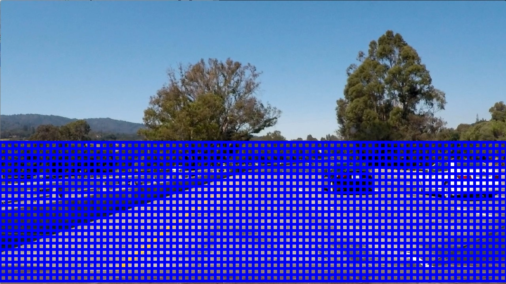

#### 2. Show some examples of test images to demonstrate how your pipeline is working.  What did you do to optimize the performance of your classifier?

the features I used is consisting from the HOG of YCrCb 3-channel, spatially binned color and histograms of color.

After that I preprocessed the data, the preprocessing process was to extract the features from the dataset and normalize it then scale it to balance the features weights.

Which provided a nice result.  Here are some example images:

|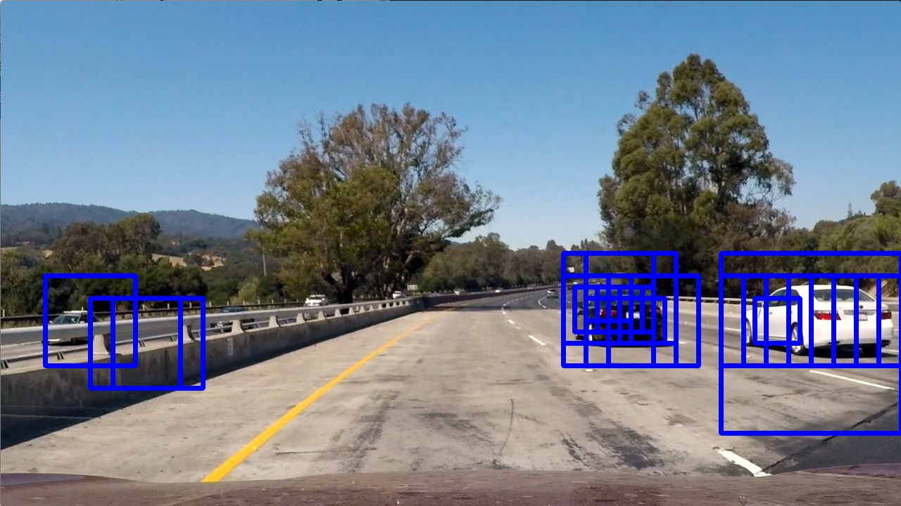|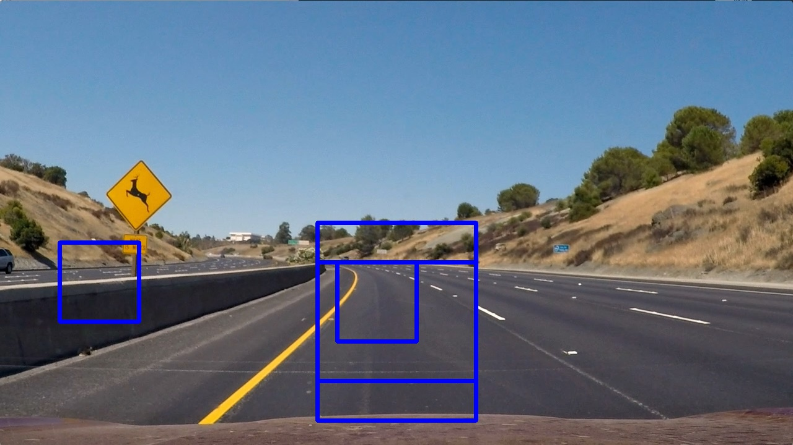|

|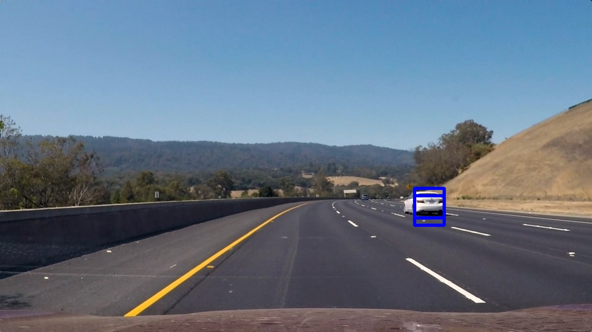|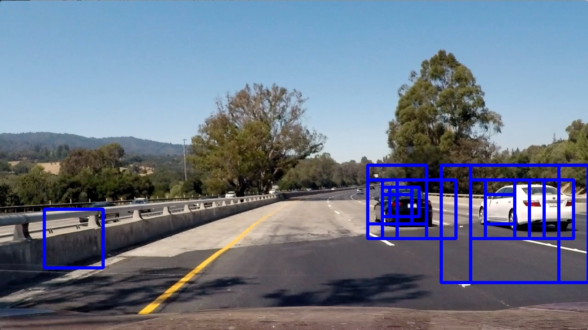|

|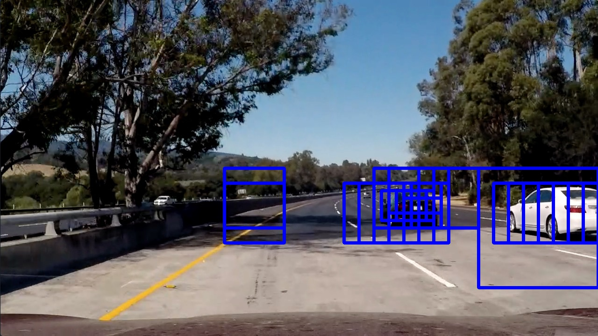|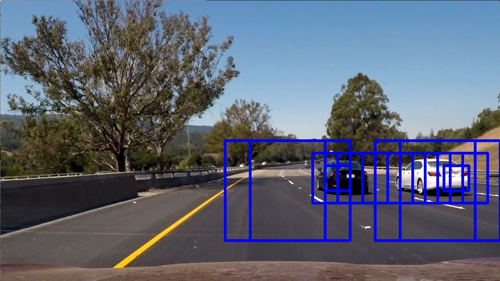|

---

### Video Implementation

#### 1. Provide a link to your final video output.  Your pipeline should perform reasonably well on the entire project video (somewhat wobbly or unstable bounding boxes are ok as long as you are identifying the vehicles most of the time with minimal false positives.)
Here's a [link to my video result](./project_video.mp4)

#### 2. Describe how (and identify where in your code) you implemented some kind of filter for false positives and some method for combining overlapping bounding boxes.

I recorded the positions of positive detections in each frame of the video.  From the positive detections I created a heatmap and then thresholded that map to identify vehicle positions (code_cell 9 - line(50-55) ).  I then used `scipy.ndimage.measurements.label()` to identify individual blobs in the heatmap (code_cell 9 - line 61).  I then assumed each blob corresponded to a vehicle.  I constructed bounding boxes to cover the area of each blob detected (code_cell 9 - line 62).

For the video frames, I take detected boxes from the last two in consideration to get a better result fot the current frame (code_cell 9 - line(35-47) )
Here's an example result showing the heatmap from a series of 3 frames of video, the result of `scipy.ndimage.measurements.label()` and the bounding boxes then overlaid on the last frame of video:

### Here are three frames and their corresponding heatmaps:

|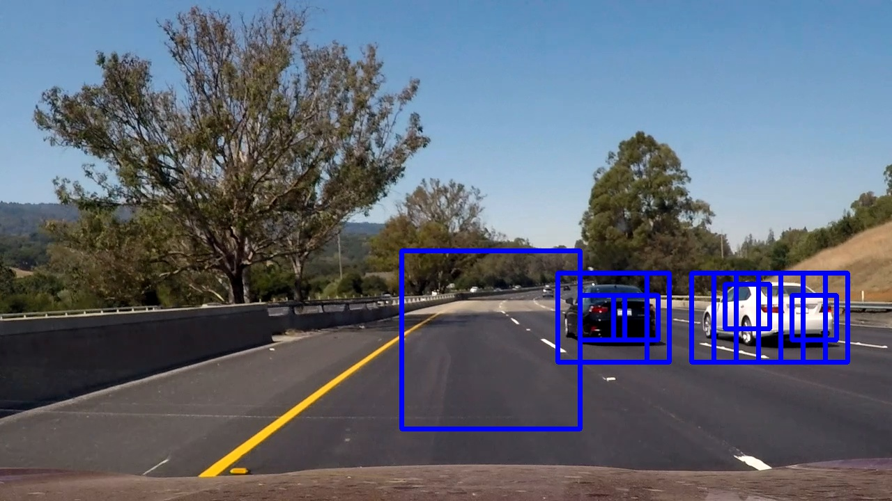|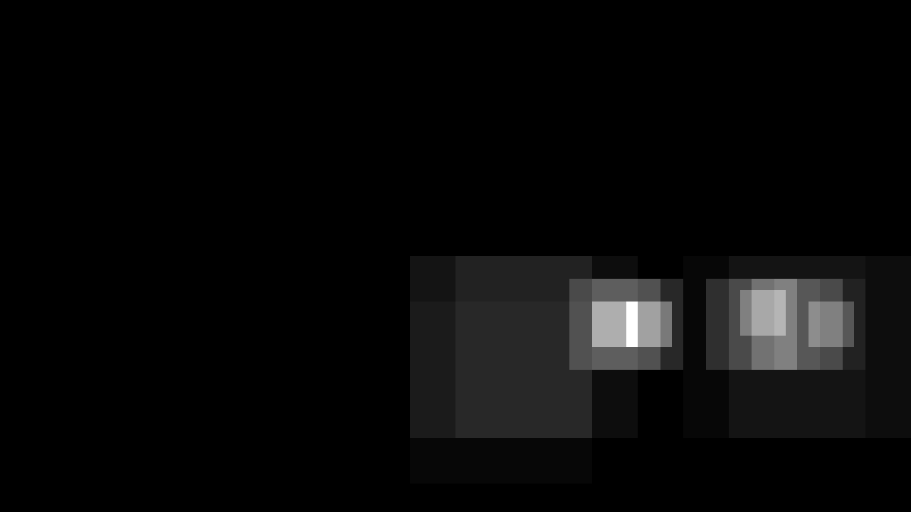|

|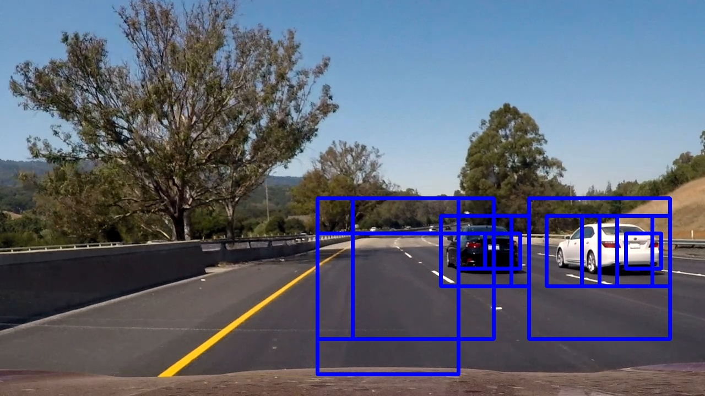|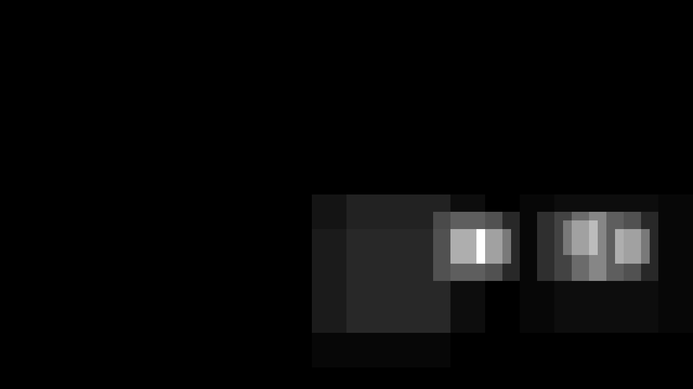|

|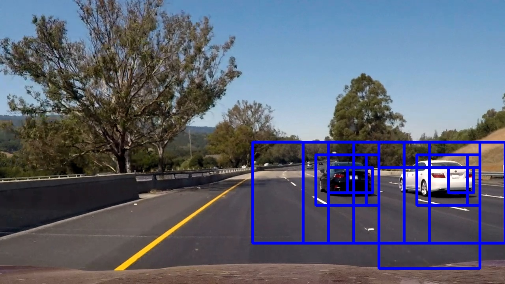|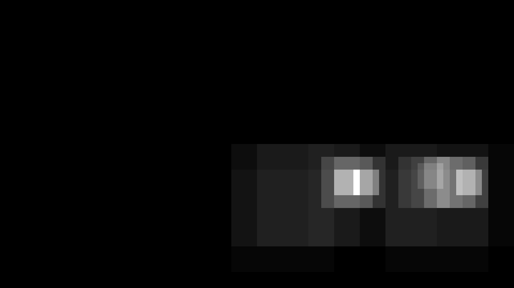|

### Here is the output of `scipy.ndimage.measurements.label()` on the integrated heatmap from all three frames:

### Here the resulting bounding boxes are drawn onto the last frame in the series:

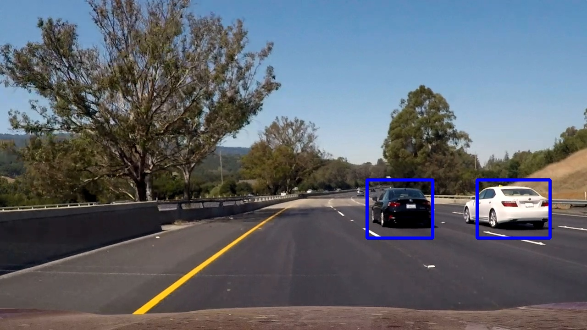

---

### Discussion

#### 1. Briefly discuss any problems / issues you faced in your implementation of this project.  Where will your pipeline likely fail?  What could you do to make it more robust?

##### problems \& solutions :
* the tuning of parameters took alot of time and that only need more powerful processor
* there are a little fale positives and that need more data for the classifier and more tuning to the parameters
* this pipline will be slow for realtime because of the big number of sliding windows and that cauld be solved by two solution: the first one to decrease the overlap area between the windows. the second one to rondomly choose sliding windows positions and scales with small number. with these two solutions we can increase the number of previous frames that the current frame result depend on
